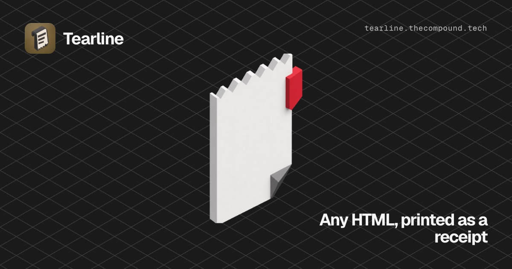

# Tearline

**Any HTML you wrap in this one tag prints out as a thermal receipt.** Then save it as a PNG your users will actually post.

Zero dependencies. No build step. Works from a `<script>` tag. MIT.



```html
<script type="module" src="https://tearline.kynth.studio/tearline.js"></script>

<tear-line barcode="047320260726">
  <h1>Meridian</h1>
  <hr>
  <p>Cortado &middot; 4.25</p>
</tear-line>
```

That script tag is a complete install — it is an ES module, so there is no bundler to configure and no build step. Verified reachable (HTTP 200) on 2026-07-29.

Or install it from npm:

```bash
npm i @kynth/tearline
```

```js
import '@kynth/tearline';
```

The package is scoped because the registry refuses the bare name `tearline` — npm's similarity filter reads it as too close to the existing `readline` package. The element is still `<tear-line>`. Published 2026-08-12; `ops/npm/publish.mjs` gates every publish on a byte-for-byte match against the component this site serves.

**[Live playground →](https://tearline.kynth.studio)**

## Why

The receipt look gets rebuilt from scratch every time somebody wants it. Receiptify turned one person's Spotify history into a receipt and got used millions of times; the aesthetic has been cloned for years. Nobody shipped the reusable piece underneath it — every `receipt` package on npm is an ESC/POS driver for *actual* thermal printers, not the look.

This is the look, as one custom element, with a PNG export so the thing your users make is a thing they can post.

## Save it as an image

```js
const el = document.querySelector('tear-line');

await el.download('receipt.png');      // saves it
const blob = await el.toBlob();        // or handle it yourself
const url  = await el.toDataURL();
```

## Attributes

| | default | |
|---|---|---|
| `width` | `330` | Paper width in pixels. |
| `seed` | `1` | Any integer. The same seed always produces the same torn edge and the same barcode, so a receipt looks identical every time it renders — and the export matches what the user saw. |
| `barcode` | — | The digits printed under the bars. Omit for no barcode. Decorative; it is not a scannable Code 128, and it doesn't pretend to be. |
| `tilt` | `-1.15` | Rotation in degrees. |
| `flat` | — | No rotation, no drop shadow. For embedding the receipt inside another layout. |
| `animate` | — | Prints out on first paint, like paper feeding from a till. Skipped under `prefers-reduced-motion`. |

## Methods

| | |
|---|---|
| `toBlob({scale})` | Resolves to a PNG `Blob`. `scale` defaults to `2`. |
| `toDataURL({scale})` | Resolves to a PNG data URL. |
| `download(name, {scale})` | Saves the PNG. |

## Styling

`h1`, `h2`, `hr`, `p`, `small`, `strong`, `table`, `ul` and `ol` are styled for you inside the receipt. Every one of those rules is `::slotted()`, which loses to your own CSS — so restyle anything you like from the outside without fighting specificity.

Paper and ink are custom properties:

```css
tear-line {
  --paper: #f6f3ec;
  --ink: #2b2724;
  --ink-strong: #1a1715;
  --ink-faded: #6a635c;
  --font: ui-monospace, Menlo, monospace;
}
```

## One export caveat, stated plainly

Rendering to an image uses an SVG `<foreignObject>`, which is sandboxed and **cannot fetch anything over the network**. Text and styles are inlined for you automatically. But an `` inside the receipt must be a `data:` URI, or it will be missing from the exported PNG. The export throws with a message saying so rather than silently handing you a receipt with a hole in it.

## Accessibility

The receipt is **real text in the light DOM** — not a canvas, not an image. It stays selectable, searchable, translatable, and is read by screen readers in document order, because the paper is styling wrapped around your markup rather than a picture of it. Your headings stay headings and your tables stay tables.

The print-out animation is skipped entirely under `prefers-reduced-motion`, and `--ink` / `--paper` are exposed so you can push contrast past the default receipt look where you need to.

## Local development

The component itself is a single dependency-free file, `src/tearline.js`. The rest of this repo is the Next.js site that hosts the playground.

```bash
npm run sync     # cp src/tearline.js public/tearline.js — the site serves the copy
npm run dev      # next dev — playground on http://localhost:3000
npm run build    # next build
npm run start    # next start — serves the production build
npm run lint     # next lint
npm run verify   # next build into .next-verify instead of .next
```

Run `npm run sync` after editing `src/tearline.js`, or the playground keeps serving the previous copy. Use `npm run verify` rather than `npm run build` while a dev server is up — it builds into a separate directory, because writing into `.next` under a running `next dev` overwrites the manifests it holds open.

Nothing in `dev/` is served; Next only publishes `public/`. `dev/export-test.html` renders a receipt, exports it, and loads the PNG back into an `` — so a broken export is visible rather than silent. `dev/product-shot.html` renders the hero product shot — a receipt on a transparent background, sized for a 1000×1000 square slot. Both load `../src/tearline.js` and open directly from disk. `dev/og-card.html` renders the 1200×630 share card and needs the dev server's origin, since it loads `/tearline.js` as a module — see `dev/README.md`.

## License

MIT © [Kynth Studios](https://kynth.studio)
